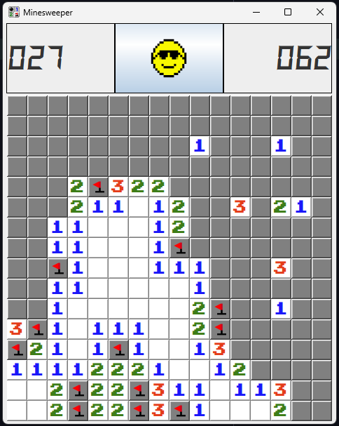
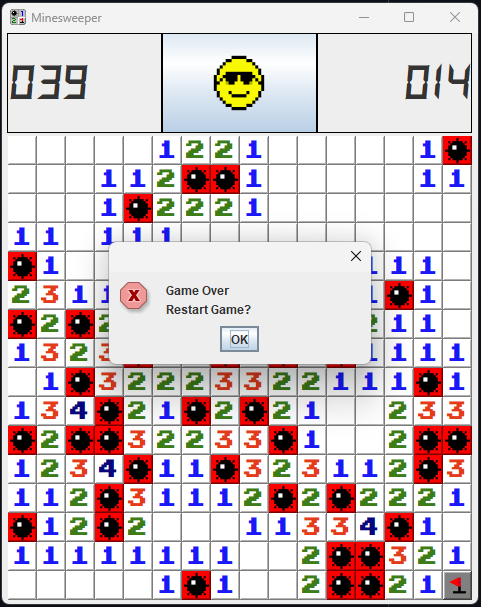

# Minesweeper

A replica resembling the legendary Minesweeper game built with Java AWT. There are 40 mines in a 16x16 field. Can you uncover all of them without blowing up?

 


## Table of Contents
- [Features](#features)
- [Installation](#installation)
- [How to Play](#how-to-play)

## Features
- Fully resizable 
- Flag and uncover cells
- Highlight nearby uncovered cells
- Real-time flagged mines counter
- Restart game option
- Timer

## Installation

### Prerequisites
- [Java 22](https://www.oracle.com/java/technologies/downloads/) or higher
- [Maven](https://maven.apache.org/download.cgi)
- [IntelliJ IDEA](https://www.jetbrains.com/idea/download/) (optional)

### Steps
1. Clone the repository:
    ```bash
    git clone https://github.com/alex-obada/MineSweeper.git
    ```
2. Navigate to the project directory:
    ```bash
    cd Minesweeper
    ```
3. Build the project with Maven:
    ```bash
    mvn clean install
    ```
4. Run the project:
    ```bash
    java -jar target/Minesweeper-1.0.0.jar
    ```
Alternatively, you can open the project in IntelliJ IDEA, navigate in the project view to the ```Main``` class and run it from the green play button.

## How to Play
- Left-click to uncover a cell.
- Right-click to place a flag on a suspected mine.
- Uncover all cells without mines in order to win the game.
- The number on a cell indicates how many mines are adjacent to it.

